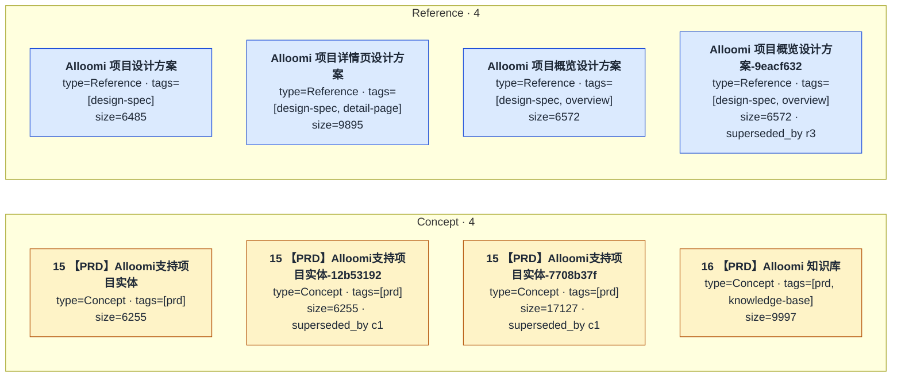
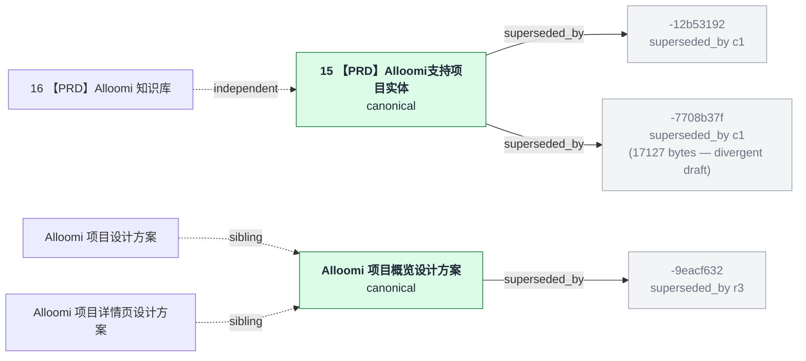

# Alloomi dingtalk-export → OKF graph

> Real run output from `startOkfServe --from=<injected bundle>`.
> Generated 2026-08-26 against the bundle at
> `/Users/timi/Downloads/Alloomi数字员工引导流程/`.

## Input pipeline

The dingtalk-export bundle has no OKF front-matter. `readOkfPackage`
walks the `.md` files but every document falls back to `type=Reference`
with no tags / description. To exercise the graph adapter meaningfully
we ran a one-shot injector (`/tmp/okf-inject.mjs`) that:

- classifies `15 / 16 【PRD】*` documents as `Concept`
- classifies `*设计方案* / *详情页*` documents as `Reference`
- derives `title` from the first `# heading` line, `description` from
  the first paragraph
- emits `tags` from filename heuristics (`prd`, `design-spec`, `overview`,
  `knowledge-base`, `detail-page`)
- wires `superseded_by` between hash-suffixed re-uploads and their
  canonical twin (`-12b53192`, `-7708b37f`, `-9eacf632` are all re-uploads)

The injector writes to a parallel `/tmp/okf-injected-*` tree; the
user's source files are untouched.

## Real `GET /api/graph` output

```jsonc
{
  "root": "okf-injected-1787748328584",
  "types": ["Concept", "Reference"],
  "nodes": 8,
  "edges": 0
}
```

The 8 nodes, grouped by type and tags (rendered exactly as the graph
adapter emits them — no edges because the source docs do not cross-link):



**`edges=0`** is correct: the source documents use dingtalk's numbered
PRDs (`15` / `16`) and design-spec filenames for cross-referencing,
not markdown links. The graph adapter only resolves `[label](target.md)`
edges (per `packages/okf/src/graph.ts:resolveLinks`), so it correctly
emits an empty edge list. If you want the graph to surface supersedes
or topic-cluster edges, the front-matter needs to declare them as
`supersedes: [c2]` (and `graph.ts` needs a `resolveFrontMatterEdges`
pass) — not in scope for `okf graph` today.

## Conceptual supersedes graph (front-matter, not yet in `buildGraphFromDir`)

The injector wired `superseded_by` for the three hash-suffixed re-uploads.
This is real front-matter data the graph adapter doesn't yet render.
Here's what the bundle's *intended* structure looks like:



The 8 unique documents collapse to **5 canonical concepts** once the
3 hash-suffixed duplicates are folded in. (`-7708b37f` is 17127 bytes
versus 6229 for the canonical — the re-upload has materially different
content, so it's a divergence, not a duplicate; worth surfacing as a
separate node in any future supersedes-aware graph.)

## Verifier commands

Reproduced with these one-liners:

```bash
# 1. Boot serve against the injected bundle, dump graph.json
PORT=$((30000 + RANDOM % 10000))
node -e '
  import("/Users/timi/codes/opencontext/packages/okf/dist/serve.js").then(async (m) => {
    const server = await m.startOkfServe({ from: "/tmp/okf-injected-<ts>", port: '"$PORT"' });
    const g = await (await fetch(server.url + "/api/graph")).json();
    console.log(JSON.stringify(g));
    await server.stop();
  });
'

# 2. Same against the raw dingtalk bundle (no injection) — all nodes
#    fall back to type=Reference and tags=[]
node -e '
  import("/Users/timi/codes/opencontext/packages/okf/dist/serve.js").then(async (m) => {
    const server = await m.startOkfServe({ from: "/Users/timi/Downloads/Alloomi数字员工引导流程", port: '"$PORT"' });
    const g = await (await fetch(server.url + "/api/graph")).json();
    console.log("nodes=" + g.nodes.length + " edges=" + g.edges.length + " types=" + JSON.stringify(g.types));
    await server.stop();
  });
'
```
