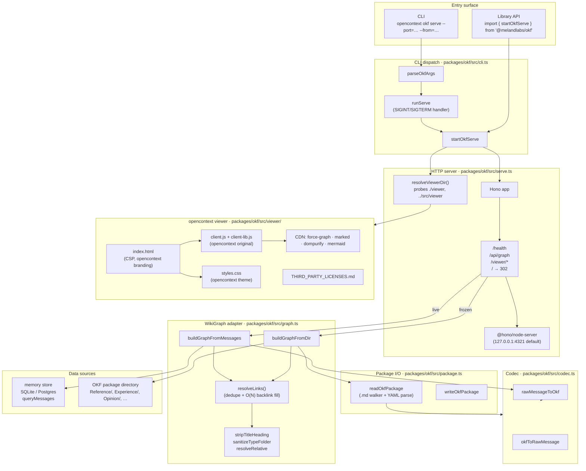
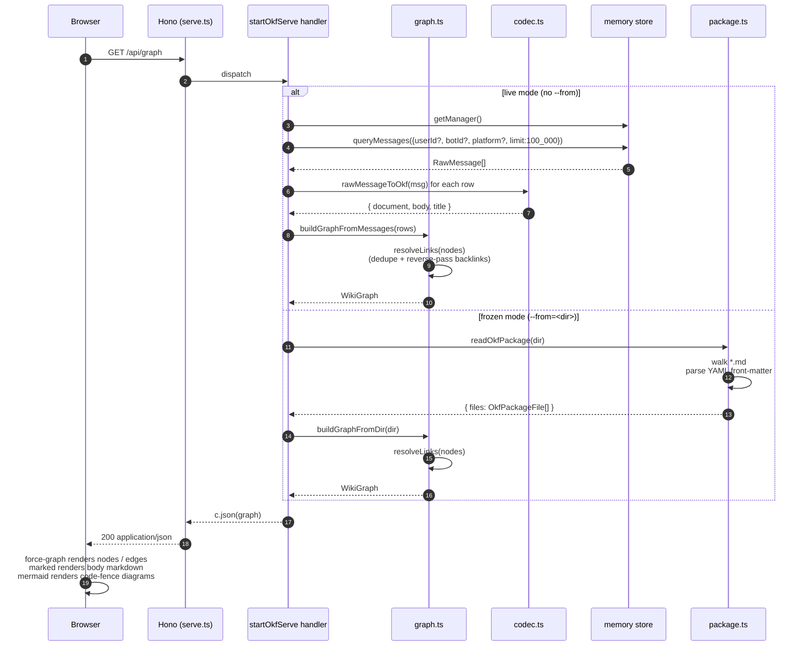
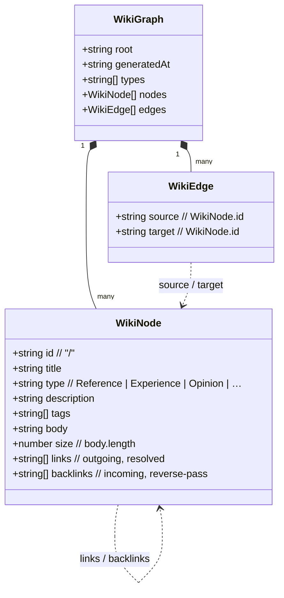

# `opencontext okf serve` — architecture

> Visual companion to the `okf serve` implementation. See `README.md`
> for the user-facing CLI surface and the live / frozen flag table.

---

## 1. Module / runtime view

**Why this shape:**

- `cli.ts` and `serve.ts` are siblings; the CLI is a thin wrapper that
  converts argv into `OkfServeOptions` and calls `startOkfServe`. A
  library user imports `startOkfServe` directly and skips the CLI
  entirely.
- The graph adapter has two entry points but shares one resolver
  (`resolveLinks`). The only real divergence is *where the rows come
  from*: `RawMessage[]` from the memory store, or `OkfDocument[]` from
  a directory walker.
- The opencontext viewer is a passive static asset; `serve.ts` resolves
  its on-disk location at startup and serves it under `/viewer/*`.
  The CDN libs (`force-graph`, `marked`, …) are still pinned to MIT /
  Apache-2.0 versions because the user explicitly deferred local
  vendoring of those (~600 KB) to a later PR.

---

## 2. Request lifecycle for `GET /api/graph`

---

## 3. `WikiGraph` data shape

**Id convention** (defined in `packages/okf/src/graph.ts`):

| Source | `id` |
| --- | --- |
| live `RawMessage` (messageId `acronym`, type `Reference`) | `Reference/acronym` |
| frozen `Reference/acronym.md` on disk | `Reference/acronym` |
| cross-folder link `[x](../Opinion/y.md)` | resolves to `Opinion/y` |

`resolveLinks` walks every node body, extracts `[label](relative.md)`
targets, resolves them against the node's parent folder (handling
`./` / `../`), strips `.md`, and filters self-links + unknown
targets. Backlinks are filled in the same pass via a reverse write
into the target node — O(N) total, no O(N²) `Set.has` lookups.

---

## 4. Facade bundling caveat

`@melandlabs/opencontext` bundles `@melandlabs/okf` (including
`startOkfServe`) into a single ESM file. After bundling,
`import.meta.url` inside `serve.ts`'s `resolveViewerDir` points at
`<facade-dist>/`, not `<okf-dist>/`. The facade's `tsup.config.ts`
has an `onSuccess` hook that copies `packages/okf/src/viewer/` →
`<facade-dist>/viewer/`, so `resolveViewerDir`'s first probe still
finds the assets.

If you change viewer files in `packages/okf/src/viewer/`, re-run
the facade build to refresh the copy.
