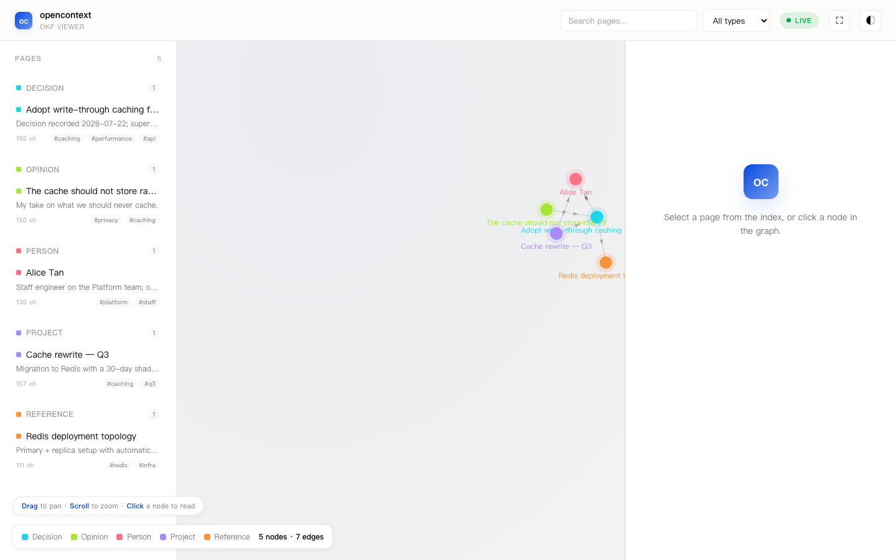
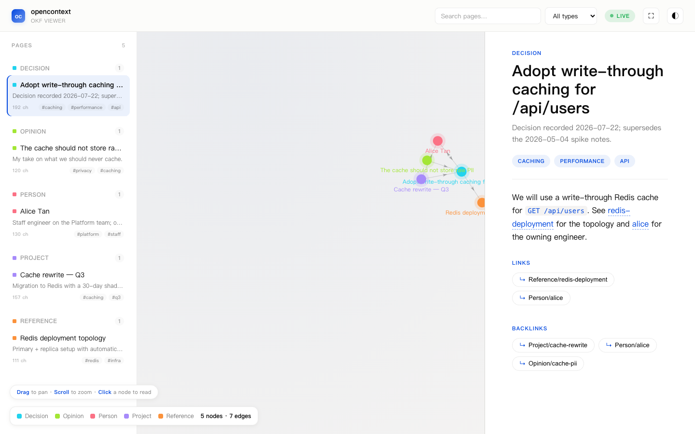
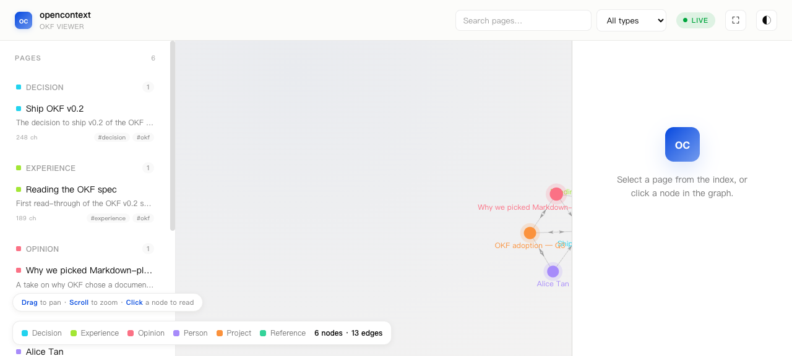
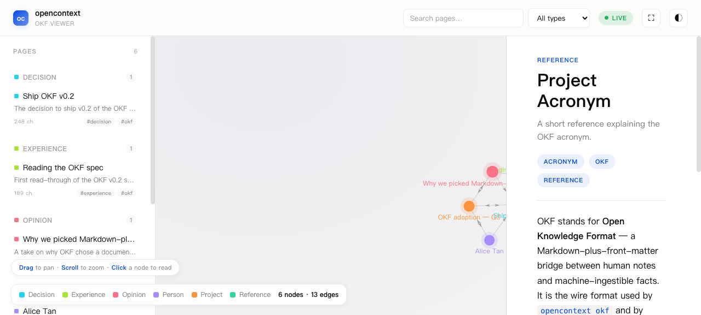

# `okf serve` Viewer

The viewer is the browser-side piece of `opencontext okf serve` (see
[`okf.md`](./okf.md) for the surface area and
[`serve-architecture.md`](./serve-architecture.md) for the server layout).
It is **original to opencontext** — every byte of HTML, JavaScript, and
CSS in `packages/okf/src/viewer/` is written here, with no upstream
branding and no third-party JS bundled. See
`packages/okf/src/viewer/THIRD_PARTY_LICENSES.md` for the four pinned
CDN libraries (force-graph, marked, DOMPurify, mermaid) and their
licenses.

### Northwind Labs fixture



The screenshot above shows the viewer pointed at the five-document
"Northwind Labs" engineering-team fixture (same domain as
`examples/src/simple/20-okf.ts` and `examples/src/simple/21-okf-serve.ts`):
`Decision/cache-strategy`, `Project/cache-rewrite`, `Person/alice`,
`Reference/redis-deployment`, `Opinion/cache-pii`. The graph renders
5 nodes and 7 edges — `Decision ↔ Reference`, `Decision ↔ Person`,
`Project ↔ Decision`, `Project ↔ Person`, and `Opinion → Decision`.



Clicking a sidebar card (or a node in the graph) loads the markdown
detail pane on the right. Front-matter is rendered as an eyebrow +
title + description + tag chips; the body is parsed by `marked` and
sanitised by `DOMPurify`; in-page `[redis-deployment]` /
`[alice]` wikilinks become clickable chips that navigate in-app, and
the LINKS / BACKLINKS footer surfaces the outgoing and incoming
edges for the current node.

### OKF self-referential fixture



Same viewer, six-document "OKF describing OKF" fixture
(`Decision/okf-v0.2`, `Experience/reading-spec`,
`Opinion/okf-overview`, `Person/alice`, `Project/okf-adoption`,
`Reference/acronym`). This fixture is what the screenshot harness
under `examples/src/simple/21-okf-serve.ts` reaches for when the
reader wants a doc that introspects on itself — the sidebar counts
6 types (Decision, Experience, Opinion, Person, Project, Reference),
the legend chips carry the per‑type swatches, and the force-graph
renders 6 nodes and 13 edges.



Clicking `Reference/acronym` in the sidebar loads its detail pane:
the front-matter eyebrow says `REFERENCE`, the title is
`Project Acronym`, the tag chips are `ACRONYM` / `OKF` /
`REFERENCE`, and the body markdown (rendered by `marked` and
sanitised by `DOMPurify`) explains what OKF stands for and links
back into the OKF adoption project and the v0.2 decision.

## File layout

```
packages/okf/src/viewer/
├── index.html              # static page (CSP, SRI, CDN libs)
├── client.js               # ESM module — bootstrap + renderers
├── client-lib.js           # shared helpers (palette, escape, signature, …)
├── styles.css              # light + dark themes
└── THIRD_PARTY_LICENSES.md # force-graph / marked / DOMPurify / mermaid / Inter
```

The same five files are copied verbatim into `packages/okf/dist/viewer/`
by `tsup.config.ts`'s `copy` step at build time, so the runtime serve
endpoint (`serve.ts`) reads them from `dist/viewer/` when imported as
the published package, and from `src/viewer/` when imported from
source via `--experimental-strip-types`.

## What the viewer actually does

`client.js` boots once per page load:

1. Wires the splitter drag, graph-collapse toggle, and theme toggle
   (persisted under the `okf-viewer:*` `localStorage` prefix).
2. Wires the search box and the `All types` filter.
3. Initialises `marked` (gfm, no breaks) and `mermaid` (strict
   security level, theme matches the active light/dark mode).
4. Fetches `GET /api/graph`, hashes it with a topology signature, and
   rebuilds the legend + sidebar + force-graph canvas only when the
   topology actually changed.

### Graph data flow

```
Hono app (serve.ts)
  └── GET /api/graph    ──►  WikiGraph (see graph.ts)
                                ├─ root, generatedAt
                                ├─ types[]
                                ├─ nodes[]   { id, title, type, body, …, links, backlinks }
                                └─ edges[]   { source, target }

client.js
  └── fetch /api/graph  ──►  ForceGraph3D (CDN) renders the canvas
```

The detail pane reads from the in-memory `graph` object by id — when a
sidebar card is clicked, the renderer looks up `node.body`, strips the
YAML front-matter via `strip_frontmatter`, runs it through
`window.marked.parse`, and passes the result through
`window.DOMPurify.sanitize` before assigning it to `innerHTML`.

### Markdown safety

The detail pane is the single XSS surface for user-supplied content.
Three layers protect it:

| layer | role |
| --- | --- |
| `escapeHtml` in `client-lib.js` | every front-matter field rendered as HTML (title, description, type, tag text, link text) is HTML-escaped before insertion |
| `DOMPurify` (CDN-pinned) | sanitises the parsed markdown body before it lands in `innerHTML` |
| CSP meta in `index.html` | `script-src 'self' https://cdn.jsdelivr.net` blocks any inline scripts, eval, or unexpected origins |

The CSP also pins every CDN library with an SRI hash, so any upstream
tampering produces a hard browser error rather than a silent change.

### Persisted UI state

Under the `okf-viewer:*` `localStorage` prefix:

| key | meaning |
| --- | --- |
| `okf-viewer:graph-width` | ratio (0–1) of the splitter position |
| `okf-viewer:graph-collapsed` | whether the graph canvas is hidden |
| `okf-viewer:theme` | `"light"` or `"dark"` |

No server state. The viewer is stateless apart from the in-memory
`graph` object populated by `GET /api/graph`.

## Endpoints it expects

The viewer talks to three URLs over the same origin:

| URL | response |
| --- | --- |
| `GET /viewer/index.html` | the static HTML page (also served at `GET /viewer/` via a directory rewrite) |
| `GET /viewer/client.js` | the ESM module |
| `GET /viewer/styles.css` | the theme |
| `GET /viewer/client-lib.js` | the helper module |
| `GET /api/graph` | the `WikiGraph` JSON document |
| `GET /health` | (optional) `{ ok, mode, port, ts }` — not consumed by the client |

Both `index.html` (line 333 of `client.js`) and `serve.ts` honour the
same contract: the SPA only ever reads from `/api/graph`, so swapping
live and frozen mode at the server doesn't require any client changes.

## End-to-end demo

`examples/src/tutorials/43-okf-serve-live.ts` walks the smallest
live-mode chain in six steps:

1. scratch store at `/tmp/okf-serve-live-<ts>/memory.db`
2. parse five fixture `.md` files into `RawMessage`s (the same
   Northwind Labs fixtures as `20-okf.ts` / `21-okf-serve.ts`)
3. insert them into SQLite via `manager.storeMessages`
4. boot the server with `startOkfServe({ port, user, rawStore })`
5. `GET /health` → `{ ok, mode, port, ts }`
6. `GET /api/graph` → pretty-print the WikiGraph

Set `OKF_KEEP_OPEN=1` to block on SIGINT after STEP 6 so the reader
can open `http://127.0.0.1:<port>/viewer/` in a browser and inspect
the rendered graph without racing the tutorial's `finally { stop() }`.

Run:

```bash
node --experimental-strip-types --no-warnings \
  examples/src/tutorials/43-okf-serve-live.ts

OKF_KEEP_OPEN=1 node --experimental-strip-types --no-warnings \
  examples/src/tutorials/43-okf-serve-live.ts
# … open http://127.0.0.1:<port>/viewer/
```

A frozen-mode counterpart lives in `examples/src/simple/21-okf-serve.ts`
— same chain but with `startOkfServe({ from: <dir> })` instead of a
live store.

## Customising the theme

All colours live as CSS custom properties on `:root` in
`styles.css`. The light theme is the default; the `[data-theme="dark"]`
selector overrides them. The viewer toggles between them via the
`◐` button in the topbar and persists the choice to
`okf-viewer:theme`.

The current light palette mirrors a warm minimal doc surface:

```css
--oc-bg: #fcfcfa;
--oc-text: rgb(10, 10, 10);
--oc-muted: rgb(10, 10, 10, 0.66);
--oc-faint: rgb(10, 10, 10, 0.42);
--oc-accent: rgb(0, 71, 223);
--oc-accent-soft: rgba(0, 71, 223, 0.08);
--oc-border: rgba(10, 10, 10, 0.08);
--oc-hover: rgba(10, 10, 10, 0.04);
```

Override any of these by editing `styles.css`; the change will appear
in both `src/viewer/` (dev) and `dist/viewer/` after the next `pnpm
--filter @melandlabs/okf build`.

## Out of scope

- **CDN → local bundling.** The four libraries are SRI-pinned but still
  loaded from `cdn.jsdelivr.net`. An audit-mode build that swaps them
  for vendored copies is a follow-up.
- **Live push.** `GET /api/graph` is one-shot per refresh; no SSE or
  WebSocket push today.
- **Editing.** The viewer is read-only. Editing flows belong in
  `opencontext` proper, not the viewer.