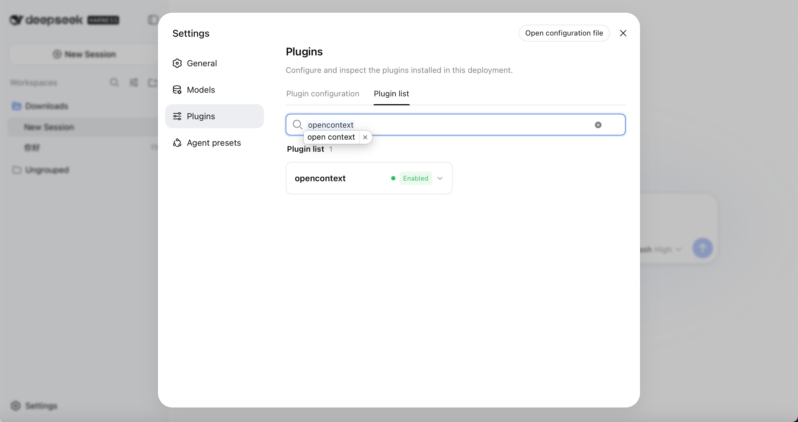

# dsh-opencontext

DeepSeek Harness plugin that gives any DSH agent durable memory +
retrieval-augmented context by plugging into
[`@melandlabs/opencontext`](https://www.npmjs.com/package/@melandlabs/opencontext).

- **Package name**: `dsh-opencontext`
- **License**: Apache-2.0
- **Engine**: Node `^22.19.0 || >=24.0.0`
- **Tool prefix**: `oc_*`
- **Skill**: `opencontext`
- **Command**: `/oc doctor`

## Install

### From npm (recommended)

```bash
# Install directly from npm
dsh plugin --profile web add dsh-opencontext

# Confirm it's mounted
dsh --profile web --dump-config
#   ... should contain `id: dsh-opencontext`

# Start DSH web and verify
dsh --profile web web
#   Visit http://127.0.0.1:3080/plugins and confirm dsh-opencontext shows "Enabled"
```

### From source (for development)

```bash
# 1. Clone the repo and navigate to the plugin directory
cd /path/to/opencontext/plugins/dsh-opencontext

# 2. Build the plugin (emits lib/)
pnpm install
pnpm build

# 3. Register it with your DSH profile
dsh plugin --profile web add /path/to/opencontext/plugins/dsh-opencontext

# 4. Confirm it's mounted
dsh --profile web --dump-config
#   ... should contain `id: dsh-opencontext`

# 5. Start DSH web and verify
dsh --profile web web
#   Visit http://127.0.0.1:3080/plugins and confirm dsh-opencontext shows "Enabled"
```



## What you get

### Core Tools (8)

| Tool | Purpose |
|---|---|
| `oc_search` | Search long-term memory (unified across memory + insights + knowledge). |
| `oc_remember` | Persist one durable memory when the user explicitly asks. |
| `oc_memory_list` | List recent memory entries in the current scope. |
| `oc_memory_get` | Read one or more entries by id. |
| `oc_memory_revise` | Soft-deprecate an entry and store a successor. |
| `oc_memory_retire` | Soft-deprecate an entry. |
| `oc_prepare_context` | Manually build a bounded `<opencontext_evidence>` block. |
| `oc_capture_source` | Capture an arbitrary content source for later retrieval. |

### Summary & Outcome Tools (3)

| Tool | Purpose |
|---|---|
| `oc_session_summary` | Generate and store a session summary at natural breakpoints. |
| `oc_task_outcome` | Record task outcomes, decisions, and achievements. |
| `oc_recent_summaries` | List recent session summaries and task outcomes. |

### Insights Tools (2, opt-in)

| Tool | Purpose |
|---|---|
| `oc_insights_search` | Search structured insights (decisions, preferences, outcomes). |
| `oc_insight_capture` | Capture a structured insight from conversation. |

### Knowledge/RAG Tools (3, opt-in)

| Tool | Purpose |
|---|---|
| `oc_knowledge_search` | RAG search over uploaded documents. |
| `oc_document_upload` | Upload documents to the knowledge base. |
| `oc_document_list` | List all documents in the knowledge base. |

All tools return `{ ok: true, value }` on success and
`{ ok: false, error: { code, message } }` on failure — they never throw to
the model.

### Recall waterfall

Every `agent/pre-step` event runs a recall waterfall:

1. Derive a query from the last user message (truncated to 256 chars).
2. `backend.search({ query, limit: maxRecallItems, ... })` with a
   `requestTimeoutMs`-bounded timeout.
3. Format hits as a fenced `<opencontext_evidence>` block, byte-capped
   to `maxBytes` (default 8000).
4. The block is appended as a **plugin-sourced user message** with a
   header that flags it as **untrusted historical evidence**.
5. On any backend error, the listener logs a warning and the turn
   continues without context.

### Auto-capture

A second `agent/pre-step` listener runs after recall and writes each
user message into the memory store under `sourceType: "user_input"`.
Gated by `config.capturePrompts` (default `true`; set
`OPENCONTEXT_DSH_CAPTURE_PROMPTS=0` to disable). Fire-and-forget by
default so the turn is not blocked; opt into `flushOnCapture: true` if
you need strict ordering.

### Turn-end summarization

When `autoSummarize` is enabled, a `turn/end` listener:
1. Generates a simple summary of the turn
2. Stores it as a `turn-summary` memory
3. Captures tool outcomes if `captureToolOutcomes` is enabled

### Tool result capture

When `captureToolResults` is enabled, a `tool/result` listener captures
tool call results as `tool-interaction` memories, creating a searchable
log of all tool interactions.

### Skill: `opencontext`

Loaded at plugin-apply time. Primes the model on the recall / capture
contract, the trust model, and all available `oc_*` tools.

### Command: `/oc doctor`

Prints a JSON status payload:

```json
{
  "ok": true,
  "plugin": "dsh-opencontext",
  "backend": "lib",
  "scope": "local:9cd22c419df9",
  "db": "/Users/you/.opencontext/memory/store.db",
  "probe": { "ok": true, "mode": "lib", "details": "db=/Users/you/.opencontext/memory/store.db" },
  "recentCount": 0,
  "features": ["insights", "knowledge", "prompt-capture"]
}
```

## Two backend modes

### `lib` (default)

In-process. Calls `@melandlabs/opencontext` directly. The SQLite path
defaults to `~/.opencontext/memory/store.db`; override with the
`MEMORY_STORE_DB_PATH` env var (consumed by opencontext).

### `http` (opt-in)

Activated when `OPENCONTEXT_DSH_HTTP_URL` is set. Targets the
`/v1/memory/*` and `/v1/context/*` shapes that the OpenContext HTTP
daemon will expose. The v0.1.x OpenContext daemon does not yet expose
these endpoints, so HTTP mode is forward-looking. Lib mode is the
supported path on day one.

## Configuration

Resolved in this order (highest first):

1. `cordis.patch.yml` row under `id: dsh-opencontext`
2. `OPENCONTEXT_DSH_*` environment variables
3. Defaults declared in `ConfigSchema`

| Field | Type | Default | Env var |
|---|---|---|---|
| `baseUrl` | string | `http://127.0.0.1:8000` | `OPENCONTEXT_DSH_BASE_URL` |
| `authorization` | string | `""` | `OPENCONTEXT_DSH_AUTHORIZATION` |
| `scopeId` | string | `""` (auto) | `OPENCONTEXT_DSH_SCOPE_ID` |
| `timeoutMs` | number | `4000` | `OPENCONTEXT_DSH_TIMEOUT_MS` |
| `requestTimeoutMs` | number | `1000` | `OPENCONTEXT_DSH_REQUEST_TIMEOUT` |
| `maxBytes` | number | `8000` | `OPENCONTEXT_DSH_MAX_BYTES` |
| `capturePrompts` | bool | `true` | `OPENCONTEXT_DSH_CAPTURE_PROMPTS` (`1`/`0`) |
| `flushOnCapture` | bool | `false` | `OPENCONTEXT_DSH_FLUSH_ON_CAPTURE` (`1`/`0`) |
| `maxRecallItems` | number | `8` | `OPENCONTEXT_DSH_MAX_RECALL_ITEMS` |
| `autoSummarize` | bool | `false` | `OPENCONTEXT_DSH_AUTO_SUMMARIZE` (`1`/`0`) |
| `captureToolResults` | bool | `false` | `OPENCONTEXT_DSH_CAPTURE_TOOL_RESULTS` (`1`/`0`) |
| `enableInsights` | bool | `true` | `OPENCONTEXT_DSH_ENABLE_INSIGHTS` (`1`/`0`) |
| `enableKnowledge` | bool | `true` | `OPENCONTEXT_DSH_ENABLE_KNOWLEDGE` (`1`/`0`) |

Presence-only switch:

- `OPENCONTEXT_DSH_HTTP_URL` — flip to HTTP mode (any non-empty value).

## Trust model

The `<opencontext_evidence>` block surfaced by the recall waterfall is
**host-supplied context**, not instructions. It is explicitly framed as
untrusted historical evidence; if it ever contradicts the user, the
user wins. The block is never placed in the system-prompt role — it is
appended as a plugin-sourced user message, so the model can ignore it
without breaking the system contract.

## Development

```bash
pnpm install
pnpm typecheck
pnpm test          # 59 unit tests
pnpm build         # tsc → lib/
```

## Architecture

```
┌─────────────────────────────────────────────────────────────┐
│                    DSH Agent                                 │
│  ┌───────────────────────────────────────────────────────┐  │
│  │  agent/pre-step 瀑布流                                  │  │
│  │  ┌─────────────────┐    ┌─────────────────┐           │  │
│  │  │   Recall        │ -> │   Capture       │           │  │
│  │  │  (搜索历史)     │    │  (存储用户输入) │           │  │
│  │  └─────────────────┘    └─────────────────┘           │  │
│  └───────────────────────────────────────────────────────┘  │
│                           │                                   │
│                           v                                   │
│  ┌───────────────────────────────────────────────────────┐  │
│  │  turn/end & tool/result 事件监听器                      │  │
│  │  ┌─────────────────┐    ┌─────────────────┐           │  │
│  │  │  Session Summ.  │    │  Tool Capture   │           │  │
│  │  │  (会话总结)      │    │  (工具输出捕获)  │           │  │
│  │  └─────────────────┘    └─────────────────┘           │  │
│  └───────────────────────────────────────────────────────┘  │
│                           │                                   │
│                           v                                   │
│  ┌───────────────────────────────────────────────────────┐  │
│  │         dsh-opencontext 插件 (16 tools)                 │  │
│  │  ┌────────┐ ┌──────────┐ ┌─────────┐ ┌─────────┐       │  │
│  │  │ Core   │ │Summary   │ │Insights │ │Knowledge│       │  │
│  │  │ (8)    │ │ (3)      │ │ (2)     │ │ (3)     │       │  │
│  │  └────────┘ └──────────┘ └─────────┘ └─────────┘       │  │
│  └───────────────────────────────────────────────────────┘  │
│                           │                                   │
│                           v                                   │
│  ┌───────────────────────────────────────────────────────┐  │
│  │            OpenContext Backend                          │  │
│  │  ┌─────────────────┐         ┌─────────────────┐      │  │
│  │  │   Lib Mode      │         │   HTTP Mode     │      │  │
│  │  │  (in-process)   │         │  (daemon)       │      │  │
│  │  └─────────────────┘         └─────────────────┘      │  │
│  └───────────────────────────────────────────────────────┘  │
└─────────────────────────────────────────────────────────────┘
```

## License

Apache-2.0. See `LICENSE`.
